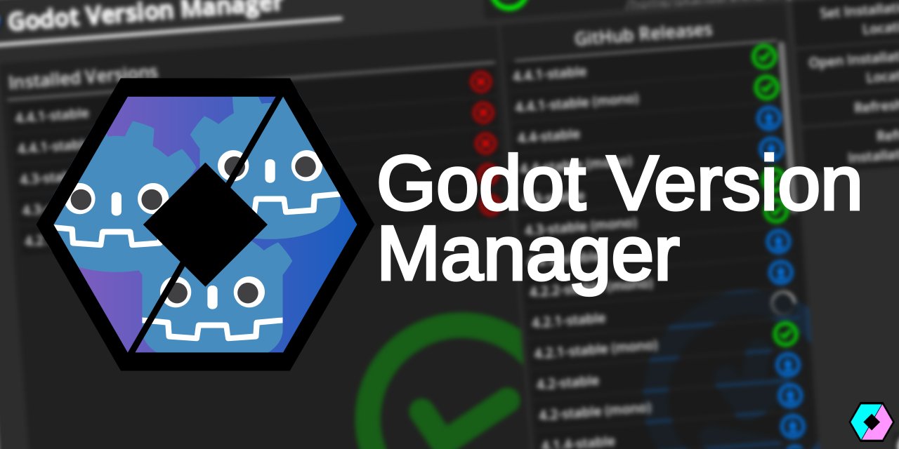

# Godot Version Manager (GVM) by Saihex Studios

    

**Godot Version Manager (GVM)** is a lightweight application developed by [Saihex Studios](https://www.saihex.com) using [Godot 4.4.1 Stable Mono](https://godotengine.org/). It allows easy access to multiple versions of the Godot Editor and includes a built-in downloader that fetches editor versions directly from Godot's official GitHub repository.

Designed to be portable, GVM can be installed on a flash drive—making your own personal "Godot On-The-Go" possible!

---

## ⚠️ Disclaimer

1. **Saihex Studios** is in no way affiliated with the [Godot Foundation](https://godot.foundation/).
2. **Saihex Studios**, at the time of this project's creation, is not a formal development studio. There are no enforced code standards or policies. However, all programs are tested—just not by professionals 😼

---

## 📜 Licensing

All code falls under the [MIT License](https://opensource.org/license/mit), while assets produced by Saihex Studios fall under the [CC BY-NC-SA 4.0 License](https://creativecommons.org/licenses/by-nc-sa/4.0/deed.en), unless otherwise stated.

### 🧩 Third-party Assets Used

1. `yourenotsafe.png` – Author unknown  
2. `notif_warning.ogg`, and `notif_chime.ogg` – Taken from the [KDE Plasma](https://kde.org/plasma-desktop/) Oxygen theme, under [LGPL-2.0-or-later](https://opensource.org/license/lgpl-2-0)
3. `download.svg`, `warning.svg`, `cross.svg`, and `checkmark.svg` icons are assets made by Preinstallable, under [CC-BY 4.0](https://creativecommons.org/licenses/by/4.0/)
4. `github-mark-white.svg` - from [GitHub](https://github.com/logos)
5. Godot logo (Used in GVM logo) - from [Godot Foundation](https://godotengine.org/press/)

---

## 🤔 Usage?

If you've ever used a file manager, you'll know how to use GVM.  
No tutorials, no setup wizard — just click, pick, and pounce.
